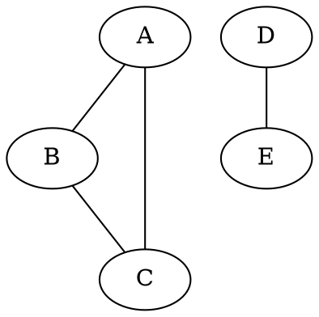
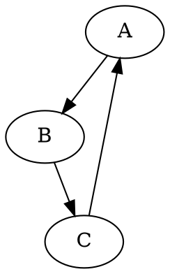

# Graph File Formats for Community Detection: A Comprehensive Reference

**Research Date:** 2026-04-29
**Purpose:** Catalog the standard, default, and de facto file formats used to represent graphs in community detection algorithms and network analysis, with a focus on interoperability between major libraries (igraph, NetworkX, CDlib, leidenalg) and benchmark datasets (LFR, SNAP, Newman).

---

## Table of Contents

1. [Executive Summary](#1-executive-summary)
2. [The De Facto Standard: Edge List Format](#2-the-de-facto-standard-edge-list-format)
3. [GML — Graph Modelling Language](#3-gml--graph-modelling-language)
4. [GraphML — Graph Markup Language](#4-graphml--graph-markup-language)
5. [Pajek NET Format](#5-pajek-net-format)
6. [GEXF — Graph Exchange XML Format](#6-gexf--graph-exchange-xml-format)
7. [Matrix Market (MTX)](#7-matrix-market-mtx)
8. [SNAP Format](#8-snap-format)
9. [DOT (Graphviz)](#9-dot-graphviz)
10. [NCOL Format](#10-ncol-format)
11. [Adjacency Matrix](#11-adjacency-matrix)
12. [Adjacency List](#12-adjacency-list)
13. [JSON-Based Formats](#13-json-based-formats)
14. [Library Default Formats](#14-library-default-formats)
15. [Benchmark Distribution Formats](#15-benchmark-distribution-formats)
16. [Format Selection Guide](#16-format-selection-guide)
17. [References](#17-references)

---

## 1. Executive Summary

**Key findings:**

- **Edge list** (whitespace-delimited, two columns) is the de facto standard for community detection benchmarks. It is the simplest format, the most widely supported, and the format in which nearly all benchmark datasets are distributed.
- **igraph** defaults to edge list format (`format = "edgelist"`) for `read_graph()` [1][2].
- **NetworkX** provides the most extensive format support (15+ formats) but has no single "default" — edge list is the most commonly used for benchmarks [3].
- **CDlib** accepts NetworkX graph objects directly; internally it operates on whatever format the wrapped algorithm expects (typically edge list or igraph Graph) [4].
- **leidenalg** accepts only `igraph.Graph` objects as input — the graph must first be loaded by igraph (from any igraph-supported format) [5][6].
- **Newman's data sets** (University of Michigan) are distributed in **GML** format [7].
- **SNAP datasets** (Stanford) are distributed in **edge list** format (tab/space-delimited, `#` comments) [8].
- **LFR benchmark** graphs are generated as edge lists (`network.dat`) with ground-truth communities as a separate membership list (`community.dat`) [9][10].
- **GraphML** is the richest interchange format (XML-based) supported by the most tools (NetworkX, igraph, Gephi, yEd, Cytoscape, graph-tool, Neo4j, JGraphT, OGDF) [11][12].

---

## 2. The De Facto Standard: Edge List Format

### 2.1 Overview

The edge list is the simplest and most widely used graph representation format. It stores a graph as a list of node pairs, one per line. It is the format of choice for community detection benchmarks and is the default input format for igraph. [1][3]

**File extensions:** `.edges`, `.edgelist`, `.txt`, `.el`, `.csv`, `.tsv`, `.dat`
**Media type:** `text/plain`

### 2.2 Format Structure

**Unweighted:**

```
1 2
2 3
3 1
4 5
```

**Weighted:**

```
1 2 0.5
2 3 1.0
3 1 2.3
```

**With comments (standard convention):**

```
# This is a comment
# Source Target Weight
1 2 0.5
2 3 1.0
```

### 2.3 Variants

| Variant | Separator | Node ID Base | Used By |
|---------|-----------|-------------|---------|
| `EdgeListSpaceZero` | whitespace | 0 | NetworKit, SNAP |
| `EdgeListSpaceOne` | whitespace | 1 | NetworKit, igraph (default) |
| `EdgeListTabZero` | tab | 0 | NetworKit, SNAP |
| `EdgeListTabOne` | tab | 1 | NetworKit |
| `EdgeListCommaOne` | comma | 1 | NetworKit |

[13]

### 2.4 Properties

| Property | Support |
|----------|---------|
| Directed graphs | Via reader flag (not encoded in file) |
| Weighted graphs | Third column for weight |
| Node attributes | Not supported |
| Edge attributes | Weight only (third column) |
| Graph attributes | Not supported |
| Isolated nodes | Not representable (unless self-loop) |
| Self-loops | Allowed |
| Parallel edges | Allowed (duplicate lines) |
| Comments | `#` prefix (standard convention) |

### 2.5 Library Support

| Library | Reader | Writer | Notes |
|---------|--------|--------|-------|
| **igraph** | `read_graph(format="edgelist")` | `write_graph(format="edgelist")` | **Default format** for `read_graph()` [1][2] |
| **NetworkX** | `read_edgelist()` | `write_edgelist()` | Weighted variant available [3] |
| **NetworKit** | `EdgeListReader` | `EdgeListWriter` | Configurable separator and ID base [13] |
| **SNAP** | `TSnap::LoadEdgeList()` | `TSnap::SaveEdgeList()` | Native format for SNAP datasets [8] |
| **graph-tool** | `load_graph("edgelist")` | `save(graph, "edgelist")` | Supports edge list input [14] |

### 2.6 Human Readability: ★★★★★ (Excellent)

A human can read and edit an edge list in any text editor. It is the most intuitive graph representation.

### 2.7 Parsing Complexity: Trivial

Parsing requires only splitting each line on whitespace. No nested structures, no state machines. O(E) time complexity.

---

## 3. GML — Graph Modelling Language

### 3.1 Overview

GML (Graph Modelling Language, also called Graph Meta Language) is a hierarchical ASCII-based format developed by Michael Himsolt. It is the standard format for the Graphlet editor and is the format used by Mark Newman's network data repository. [7][15][16]

**File extension:** `.gml`
**Media type:** `text/vnd.gml`

### 3.2 Format Structure

A GML file is a tree of key-value pairs:

```gml
graph [
  comment "This is a sample graph"
  directed 1
  id 42
  label "Hello, I am a graph"
  node [
    id 1
    label "node 1"
    thisIsASampleAttribute 42
  ]
  node [
    id 2
    label "node 2"
  ]
  edge [
    source 1
    target 2
    label "Edge from node 1 to node 2"
  ]
]
```

### 3.3 Properties

| Property | Support |
|----------|---------|
| Directed graphs | `directed 1` or `directed 0` |
| Weighted graphs | Via custom edge attributes |
| Node attributes | Yes (arbitrary key-value pairs) |
| Edge attributes | Yes (arbitrary key-value pairs) |
| Graph attributes | Yes (arbitrary key-value pairs) |
| Isolated nodes | Yes |
| Self-loops | Allowed |
| Parallel edges | Allowed |
| Comments | `#` prefix |
| Encoding | 7-bit ASCII (ISO 8859-1 with `&name;` encoding) |

### 3.4 Library Support

| Library | Reader | Writer | Notes |
|---------|--------|--------|-------|
| **igraph** | `read_graph(format="gml")` | `write_graph(format="gml")` | Full support [1] |
| **NetworkX** | `read_gml()` | `write_gml()` | Via `pyparsing` or custom parser [3] |
| **Cytoscape** | Native import | Native export | Primary format [11] |
| **Gephi** | Import | Import | Full support [11] |
| **yEd** | Native | Native | Primary format [11] |
| **graph-tool** | `load_graph("gml")` | `save(graph, "gml")` | Supported but properties read as strings [14] |

### 3.5 Human Readability: ★★★★☆ (Good)

Hierarchical and indented, easy to follow for small graphs. The key-value structure is intuitive.

### 3.6 Parsing Complexity: Moderate

Requires a recursive descent parser (tree structure). Need to handle string escaping (`&quot;`, `&amp;`), nested brackets, and 7-bit ASCII constraints. [15]

---

## 4. GraphML — Graph Markup Language

### 4.1 Overview

GraphML is an XML-based file format resulting from a joint effort of the graph drawing community to define a common interchange format. Established as an open standard in 2007 under a permissive license, it is the most feature-rich graph exchange format and the most widely supported across tools. [11][12][17][18]

**File extension:** `.graphml` (also `.graphml.xml`)
**Media type:** `application/xml`

### 4.2 Format Structure

```xml
<?xml version="1.0" encoding="UTF-8"?>
<graphml xmlns="http://graphml.graphdrawing.org/xmlns"
         xmlns:xsi="http://www.w3.org/2001/XMLSchema-instance"
         xsi:schemaLocation="http://graphml.graphdrawing.org/xmlns
         http://graphml.graphdrawing.org/xmlns/1.0/graphml.xsd">
  <key id="d0" for="node" attr.name="color" attr.type="string"/>
  <key id="d1" for="edge" attr.name="weight" attr.type="double"/>
  <graph id="G" edgedefault="undirected">
    <node id="n0">
      <data key="d0">red</data>
    </node>
    <node id="n1">
      <data key="d0">blue</data>
    </node>
    <edge source="n0" target="n1">
      <data key="d1">0.5</data>
    </edge>
  </graph>
</graphml>
```

### 4.3 Properties

| Property | Support |
|----------|---------|
| Directed graphs | `edgedefault="directed"` or `"undirected"` |
| Weighted graphs | Via `<key>` declarations |
| Node attributes | Yes (typed via `<key>`) |
| Edge attributes | Yes (typed via `<key>`) |
| Graph attributes | Yes |
| Isolated nodes | Yes |
| Self-loops | Allowed |
| Parallel edges | Allowed |
| Hyperedges | Supported |
| Nested graphs | In nodes and edges |
| Mixed directionality | Yes |
| Typed edges | Yes |

### 4.4 Library Support

GraphML is supported by the most tools of any graph format: [11][12]

| Library | Reader | Writer | Notes |
|---------|--------|--------|-------|
| **NetworkX** | `read_graphml()` | `write_graphml()` | Full support [3] |
| **igraph** | `read_graph(format="graphml")` | `write_graph(format="graphml")` | Basic import (no nested graphs or hyperedges) [1] |
| **Cytoscape** | Native | Native | Full support [11] |
| **Gephi** | Native | Native | Full support [11] |
| **yEd** | Native | Native | Full support [11] |
| **graph-tool** | `load_graph("graphml")` | `save(graph, "graphml")` | Preferred text format (with `.gt`) [14] |
| **Neo4j** | Via APOC | Via APOC | Via `apoc.import.graphml` [11] |
| **JGraphT** | Yes | Yes | Java graph library [11] |
| **OGDF** | Yes | Yes | Open Graph Drawing Framework [11] |
| **Boost Graph Library** | Yes | Yes | Via `read_graphml()` [11] |
| **SocNetV** | Yes | Yes | Social Networks Visualizer [11] |

### 4.5 Human Readability: ★★★☆☆ (Moderate)

XML-based, so readable but verbose. The nested tag structure and namespace declarations add overhead. Small graphs are easy to inspect; large graphs are not practical to read.

### 4.6 Parsing Complexity: High

Requires an XML parser. Must handle `<key>` declarations for attribute types, nested `<graph>` elements, and the GraphML namespace. The specification has both DTD and XSD versions (1.0 and 1.1) with minor differences. [17][18]

---

## 5. Pajek NET Format

### 5.1 Overview

Pajek (Slovenian for "spider") is a program for analysis and visualization of large networks. Its native `.net` format has become a standard in social network analysis, particularly in Eastern European research communities. [19][20]

**File extension:** `.net`
**Media type:** `text/plain`

### 5.2 Format Structure

```
*Vertices 5
1 "Node 1" 0.0 0.0 0.0 ic Blue
2 "Node 2" 0.0 0.0 0.0 ic Red
3 "Node 3" 0.0 0.0 0.0 ic Green
*Edges
1 2 1.0
2 3 0.5
3 1 2.0
```

### 5.3 Properties

| Property | Support |
|----------|---------|
| Directed graphs | `*Arcs` section (vs `*Edges` for undirected) |
| Weighted graphs | Third column on edge lines |
| Node attributes | Label, coordinates, color |
| Edge attributes | Weight, color (limited) |
| Graph attributes | Not directly |
| Isolated nodes | Yes (listed in `*Vertices` but absent from `*Edges`) |
| Self-loops | Allowed |
| Partitions | Separate `.clu` files |
| Vectors | Separate `.vec` files |

### 5.4 Library Support

| Library | Reader | Writer | Notes |
|---------|--------|--------|-------|
| **igraph** | `read_graph(format="pajek")` | `write_graph(format="pajek")` | Full support [1] |
| **NetworkX** | `read_pajek()` | `write_pajek()` | Full support [3] |
| **Gephi** | Import | — | Basic import (labels only) [20] |
| **Pajek** | Native | Native | Reference implementation [19] |
| **Infomap** | Native | — | Supported as input [19] |
| **NetworkX (CDlib)** | Via `read_pajek()` | — | Through NetworkX bridge |

### 5.5 Human Readability: ★★★★☆ (Good)

Structured sections make it easy to navigate. The `*Vertices` and `*Edges` headers are intuitive.

### 5.6 Parsing Complexity: Moderate

Section-based format with specific keywords (`*Vertices`, `*Edges`, `*Arcs`). Must handle coordinate data, quoted labels, and companion files (`.clu`, `.vec`, `.per`). [19][20]

---

## 6. GEXF — Graph Exchange XML Format

### 6.1 Overview

GEXF (Graph Exchange XML Format) was developed by the Gephi project for exchanging graph structures, attributes, and visualization metadata. It is the native format of Gephi and supports dynamic graphs and hierarchical structures. [21][22]

**File extension:** `.gexf`
**Media type:** `application/xml`
**Specification version:** 1.3 [22]

### 6.2 Format Structure

```xml
<?xml version="1.0" encoding="UTF-8"?>
<gexf xmlns="http://www.gexf.net/1.3" version="1.3">
  <graph defaultedgetype="undirected">
    <attributes class="node">
      <attribute id="0" title="color" type="string"/>
    </attributes>
    <attributes class="edge">
      <attribute id="1" title="weight" type="float"/>
    </attributes>
    <nodes>
      <node id="0" label="Node 1">
        <attvalues>
          <attvalue for="0" value="red"/>
        </attvalues>
      </node>
      <node id="1" label="Node 2">
        <attvalues>
          <attvalue for="0" value="blue"/>
        </attvalues>
      </node>
    </nodes>
    <edges>
      <edge id="0" source="0" target="1">
        <attvalues>
          <attvalue for="1" value="0.5"/>
        </attvalues>
      </edge>
    </edges>
  </graph>
</gexf>
```

### 6.3 Properties

| Property | Support |
|----------|---------|
| Directed graphs | `defaultedgetype` attribute |
| Weighted graphs | Typed attributes |
| Node attributes | Yes (typed: string, float, int, list, etc.) |
| Edge attributes | Yes (typed) |
| Graph attributes | Yes |
| Dynamic graphs | Yes (start/end timestamps) |
| Visualization | Built-in `viz` module (colors, sizes, positions) |
| Hierarchical graphs | Yes |
| Parallel edges | Allowed |
| Self-loops | Allowed |

### 6.4 Library Support

| Library | Reader | Writer | Notes |
|---------|--------|--------|-------|
| **NetworkX** | `read_gexf()` | `write_gexf()` | Full support [3] |
| **Gephi** | Native | Native | Reference implementation [21] |
| **igraph** | — | — | Not supported [1] |
| **graph-tool** | — | — | Not supported [14] |

### 6.5 Human Readability: ★★☆☆☆ (Fair)

XML-based and verbose. The `<attvalues>` indirection makes it harder to read than GraphML.

### 6.6 Parsing Complexity: High

Requires XML parsing with namespace handling. The `<attributes>` class declarations define types that are referenced by `<attvalues>` — requiring two-pass parsing or lookahead. [21][22]

---

## 7. Matrix Market (MTX)

### 7.1 Overview

Matrix Market (MTX) is a text-based format developed by NIST for exchanging sparse matrix data. In graph contexts, each non-zero entry represents an edge. It is used by the SuiteSparse Matrix Collection (formerly University of Florida Sparse Matrix Collection) and some SNAP datasets. [23][24][25]

**File extension:** `.mtx`
**Media type:** `text/plain`

### 7.2 Format Structure

```
%%MatrixMarket matrix coordinate integer symmetric
%
% A sample graph adjacency matrix
%
4 4 5
1 2 1
1 3 1
2 3 1
3 4 1
4 1 1
```

### 7.3 Properties

| Property | Support |
|----------|---------|
| Directed graphs | Via `general` symmetry |
| Weighted graphs | `real` or `integer` type |
| Node attributes | Not supported |
| Edge attributes | Not supported |
| Symmetric matrices | `symmetric`, `skew-symmetric`, `Hermitian` |
| Sparse matrices | `coordinate` format |
| Dense matrices | `array` format |
| Comments | `%` prefix |

### 7.4 Library Support

| Library | Reader | Writer | Notes |
|---------|--------|--------|-------|
| **NetworkX** | `read_matrix_market()` | `write_matrix_market()` | Via SciPy [3] |
| **igraph** | — | — | Not directly supported |
| **SuiteSparse** | Native | Native | Reference collection [24] |
| **SciPy** | `mmread()` | `mmwrite()` | Sparse matrix I/O [25] |

### 7.5 Human Readability: ★★★☆☆ (Moderate)

The header is clear but the body is just coordinate triples. Not as intuitive as edge list for graph interpretation.

### 7.6 Parsing Complexity: Low

Simple line-based parsing. Header line + size line + data lines. Must handle the `%%MatrixMarket` magic string and symmetry types. [23][25]

---

## 8. SNAP Format

### 8.1 Overview

The SNAP (Stanford Network Analysis Platform) format is a simple edge list variant used for the Stanford Large Network Dataset Collection. It is functionally equivalent to the edge list format with specific conventions for the SNAP ecosystem. [8][13]

**File extensions:** `.txt`, `.edges`, `.tab`, `.csv`
**Media type:** `text/plain`

### 8.2 Format Structure

```
# Directed graph (each unordered pair is saved once)
# Friendster social network
# Nodes: 65608366 Edges: 1806067135
# FromNodeId	ToNodeId
0	1
0	2
0	3
1	2
```

### 8.3 Properties

| Property | Support |
|----------|---------|
| Directed graphs | Yes (reader flag) |
| Weighted graphs | Third column |
| Node attributes | Not supported |
| Edge attributes | Weight only |
| Graph attributes | Not supported |
| Isolated nodes | Not representable |
| Self-loops | Allowed |
| Parallel edges | Depends on reader |
| Comments | `#` prefix |

### 8.4 Library Support

| Library | Reader | Writer | Notes |
|---------|--------|--------|-------|
| **SNAP** | `TSnap::LoadEdgeList()` | `TSnap::SaveEdgeList()` | Native [8] |
| **NetworKit** | `EdgeListReader` | `EdgeListWriter` | Configurable [13] |
| **NetworkX** | `read_edgelist()` | `write_edgelist()` | Directly readable [3] |
| **igraph** | `read_graph(format="edgelist")` | — | Directly readable [1] |

### 8.5 Human Readability: ★★★★★ (Excellent)

Identical to edge list. The `#` comment header typically documents the dataset.

### 8.6 Parsing Complexity: Trivial

Same as edge list. Split on whitespace, ignore `#` lines. [8][13]

---

## 9. DOT (Graphviz)

### 9.1 Overview

DOT is the graph description language used by Graphviz, a widely-used graph visualization tool. It is designed for specifying graphs for visualization rather than for data interchange, but it is supported by many graph tools. [26][27]

**File extension:** `.dot`, `.gv`
**Media type:** `text/vnd.graphviz`

### 9.2 Format Structure



For directed graphs:



### 9.3 Properties

| Property | Support |
|----------|---------|
| Directed graphs | `digraph` keyword |
| Weighted graphs | `weight` attribute |
| Node attributes | Yes (color, shape, label, etc.) |
| Edge attributes | Yes (color, style, label, etc.) |
| Graph attributes | Yes |
| Subgraphs | Yes (with `cluster` prefix) |
| Isolated nodes | Yes |
| Self-loops | Allowed |
| Parallel edges | Not supported (multigraph) |

### 9.4 Library Support

| Library | Reader | Writer | Notes |
|---------|--------|--------|-------|
| **Graphviz** | Native | Native | Reference implementation [26] |
| **NetworkX** | `read_dot()` (via pygraphviz) | `write_dot()` | Requires pygraphviz [3] |
| **graph-tool** | `load_graph("dot")` | `save(graph, "dot")` | Supported [14] |
| **igraph** | — | — | Not supported [1] |

### 9.5 Human Readability: ★★★★☆ (Good)

Intuitive syntax. The `A -- B` notation is easy to understand for small graphs.

### 9.6 Parsing Complexity: Moderate

Requires a parser for the DOT language grammar. Must handle graph/subgraph hierarchies, attribute lists, node IDs, and the distinction between `graph`/`digraph`. [26][27]

---

## 10. NCOL Format

### 10.1 Overview

NCOL (Named Column) format is a symbolic edge list used by the Large Graph Layout (LGL) program. It is supported by igraph as an alternative to the plain edge list. [1][28]

**File extension:** `.ncol`
**Media type:** `text/plain`

### 10.2 Format Structure

```
# Node1 Node2 Weight
nodeA nodeB 0.5
nodeB nodeC 1.0
nodeC nodeA 2.3
```

### 10.3 Properties

| Property | Support |
|----------|---------|
| Directed graphs | Not natively (undirected only) |
| Weighted graphs | Third column |
| Node attributes | Not supported |
| Edge attributes | Weight only |
| Symbolic node names | Yes (not restricted to integers) |
| Self-loops | Allowed |

### 10.4 Library Support

| Library | Reader | Writer | Notes |
|---------|--------|--------|-------|
| **igraph** | `read_graph(format="ncol")` | `write_graph(format="ncol")` | Supported [1][28] |
| **LGL** | Native | Native | Reference implementation [28] |

### 10.5 Human Readability: ★★★★★ (Excellent)

Same readability as edge list.

### 10.6 Parsing Complexity: Trivial

Identical to edge list parsing. [28]

---

## 11. Adjacency Matrix

### 11.1 Overview

The adjacency matrix is a square matrix where entry (i, j) indicates the presence (and optionally weight) of an edge between nodes i and j. It is a fundamental mathematical representation but less common as a file format for large graphs due to its O(V²) space complexity. [29][30]

**File extensions:** `.adj`, `.mat`, `.mtx` (sparse), `.csv`
**Media type:** `text/plain`

### 11.2 Format Structure

**Dense:**

```
0 1 1 0
1 0 1 0
1 1 0 1
0 0 1 0
```

**Weighted:**

```
0.0 0.5 1.2 0.0
0.5 0.0 0.0 0.0
1.2 0.0 0.0 3.4
0.0 0.0 3.4 0.0
```

### 11.3 Properties

| Property | Support |
|----------|---------|
| Directed graphs | Asymmetric matrix |
| Weighted graphs | Non-binary entries |
| Node attributes | Not supported |
| Edge attributes | Weight only |
| Graph attributes | Not supported |
| Isolated nodes | Yes (zero rows/columns) |
| Self-loops | Yes (diagonal entries) |
| Space complexity | O(V²) dense, O(E) sparse |

### 11.4 Library Support

| Library | Reader | Writer | Notes |
|---------|--------|--------|-------|
| **graph-tool** | `Graph(sparse_matrix)` | — | Native from SciPy sparse [14] |
| **NumPy/SciPy** | `np.loadtxt()` | `np.savetxt()` | Dense matrices [29] |
| **igraph** | `igraph.Graph.Adjacency()` | — | From matrix in memory [1] |

### 11.5 Human Readability: ★★☆☆☆ (Fair)

Readable only for very small graphs (V < 20). Becomes unreadable for typical community detection graphs.

### 11.6 Parsing Complexity: Trivial (dense) / Low (sparse)

Dense: read V lines, split each into V values. Sparse: read coordinate triples (same as Matrix Market without the header). [29][30]

---

## 12. Adjacency List

### 12.1 Overview

The adjacency list format represents each node followed by its neighbors. It is more compact than the adjacency matrix for sparse graphs and is the natural representation for many graph algorithms. [29][30]

**File extensions:** `.adjlist`, `.lst`, `.txt`
**Media type:** `text/plain`

### 12.2 Format Structure

**Standard:**

```
1 2 3
2 1 3
3 1 2 4
4 3
```

Each line starts with a node followed by its neighbors.

**Multiline:**

```
1
2
3
2
1
3
3
1
2
4
4
3
```

### 12.3 Properties

| Property | Support |
|----------|---------|
| Directed graphs | Via reader flag |
| Weighted graphs | Not in standard format (multiline variant supports it) |
| Node attributes | Not supported |
| Edge attributes | Not in standard format |
| Isolated nodes | Yes (empty line or single node) |
| Self-loops | Allowed |
| Parallel edges | Not supported |

### 12.4 Library Support

| Library | Reader | Writer | Notes |
|---------|--------|--------|-------|
| **NetworkX** | `read_adjlist()` | `write_adjlist()` | Standard and multiline [3] |
| **igraph** | — | — | Not supported [1] |
| **graph-tool** | `Graph({0: [2,3], ...})` | — | Via Python dict [14] |

### 12.5 Human Readability: ★★★☆☆ (Moderate)

Readable for small graphs. Each line's meaning depends on position (first entry is the node, rest are neighbors).

### 12.6 Parsing Complexity: Trivial

Split each line; first element is the node, remaining elements are neighbors. [3]

---

## 13. JSON-Based Formats

### 13.1 Overview

JSON-based formats represent graphs as structured JSON objects. They are primarily used for web-based visualization (D3.js) and API interchange, not for benchmark distribution. [3][31]

**File extensions:** `.json`, `.jgf`, `.graphology.json`
**Media type:** `application/json`

### 13.2 Format Variants

**NetworkX Node-Link (most common):**

```json
{
  "directed": false,
  "multigraph": false,
  "graph": {},
  "nodes": [
    {"id": "A", "group": 1},
    {"id": "B", "group": 1},
    {"id": "C", "group": 2}
  ],
  "links": [
    {"source": "A", "target": "B", "weight": 0.5},
    {"source": "B", "target": "C", "weight": 1.0},
    {"source": "C", "target": "A", "weight": 2.3}
  ]
}
```

### 13.3 Properties

| Property | Support |
|----------|---------|
| Directed graphs | `directed` field |
| Weighted graphs | `weight` attribute in links |
| Node attributes | Yes |
| Edge attributes | Yes |
| Graph attributes | Yes |
| Isolated nodes | Yes |
| Self-loops | Allowed |
| Parallel edges | With `multigraph: true` and `key` |
| Nested graphs | Not typically |

### 13.4 Library Support

| Library | Reader | Writer | Notes |
|---------|--------|--------|-------|
| **NetworkX** | `node_link_graph()` | `node_link_data()` | Primary JSON format [3][31] |
| **D3.js** | Native | — | `d3.json()` for loading [31] |
| **Cytoscape.js** | Native | — | Cytoscape web variant |
| **Graphology** | `Graph.from()` | `graph.export()` | JS/TypeScript [31] |
| **igraph** | — | — | Not supported |

### 13.5 Human Readability: ★★★☆☆ (Moderate)

JSON is structured but verbose. The node-link split requires cross-referencing `source`/`target` with node `id`.

### 13.6 Parsing Complexity: Low

Use any JSON parser. The challenge is resolving `source`/`target` references to node objects. [3][31]

---

## 14. Library Default Formats

### 14.1 igraph

igraph's `read_graph()` function defaults to `format = "edgelist"`. Supported formats include: [1][2]

| Format | Read | Write | Notes |
|--------|------|-------|-------|
| **edgelist** | ✓ | ✓ | **Default for read_graph()** |
| ncol | ✓ | ✓ | Symbolic edge list |
| lgl | ✓ | — | LGL format |
| graphml | ✓ | ✓ | XML-based |
| gml | ✓ | ✓ | Hierarchical ASCII |
| pajek | ✓ | ✓ | Section-based |
| dimacs | ✓ | ✓ | Max-flow/clique |
| graphdb | ✓ | — | GraphDB format |
| dl | ✓ | — | UCINET |
| dot | — | — | Not supported |
| gexf | — | — | Not supported |

### 14.2 NetworkX

NetworkX has no single default format — the user must explicitly choose a reader/writer. The most commonly used formats are: [3]

| Format | Read Function | Write Function | Typical Extension |
|--------|--------------|----------------|-------------------|
| Edge list | `read_edgelist()` | `write_edgelist()` | `.edges`, `.edgelist` |
| GML | `read_gml()` | `write_gml()` | `.gml` |
| GraphML | `read_graphml()` | `write_graphml()` | `.graphml` |
| Pajek | `read_pajek()` | `write_pajek()` | `.net` |
| GEXF | `read_gexf()` | `write_gexf()` | `.gexf` |
| Adjacency list | `read_adjlist()` | `write_adjlist()` | `.adjlist` |
| JSON node-link | `node_link_graph()` | `node_link_data()` | `.json` |
| Matrix Market | `read_matrix_market()` | `write_matrix_market()` | `.mtx` |
| Graph6/Sparse6 | `read_graph6()` | `write_graph6()` | `.g6`, `.s6` |
| LEDA | `read_leda()` | — | `.leda` |
| DOT | `read_dot()` | `write_dot()` | `.dot` |

### 14.3 CDlib

CDlib is a meta-library that accepts NetworkX graph objects as its standard input. It does not define its own file format — graphs are loaded via NetworkX readers and passed to CDlib algorithms. The algorithms themselves delegate to backends (igraph, NetworkX, graph-tool, etc.), each expecting their own format. [4]

```python
import networkx as nx
import cdlib

# CDlib accepts NetworkX graphs
G = nx.read_edgelist("graph.edges")  # or any NetworkX reader
communities = cdlib.algorithms.louvain(G)
```

### 14.4 leidenalg

leidenalg operates exclusively on `igraph.Graph` objects. The user must first load the graph using igraph (from any igraph-supported format), then pass it to leidenalg: [5][6]

```python
import igraph as ig
import leidenalg

# leidenalg requires an igraph.Graph
g = ig.Graph.Read_Edgelist("graph.edges", directed=False)
# or: g = ig.Graph.Read_GML("graph.gml")
partition = leidenalg.find_partition(g, leidenalg.ModularityVertexPartition)
```

**Key implication:** The effective "input format" for leidenalg is whatever igraph supports, with edge list being the igraph default.

---

## 15. Benchmark Distribution Formats

### 15.1 LFR Benchmark Graphs

The LFR (Lancichinetti-Fortunato-Radicchi) benchmark is the gold standard for community detection evaluation. The original C implementation outputs: [9][10]

| File | Format | Description |
|------|--------|-------------|
| `network.dat` | Edge list | Generated graph edges |
| `community.dat` | Membership list | Ground-truth community assignments |
| `statistics.dat` | Key-value | Network statistics |

**Edge list format (`network.dat`):**

```
# NodeID NodeID
1 2
1 3
2 4
...
```

**Community membership format (`community.dat`):**

```
# NodeID CommunityID
1 1
2 1
3 2
4 2
...
```

The Zenodo LFR dataset distributes graphs in edge list format with ground-truth communities as membership lists and JSON. [10]

### 15.2 SNAP Datasets

The Stanford Large Network Dataset Collection distributes all graphs in edge list format: [8]

- Tab or space-delimited
- `#` comment headers documenting the dataset
- Two columns (unweighted) or three columns (weighted)
- Node IDs are integers
- Both 0-indexed and 1-indexed datasets exist

**Example (ego-Facebook):**

```
# Undirected graph (each unordered pair is saved once)
# Facebook social network
# Nodes: 4039 Edges: 88234
# FromNodeId	ToNodeId
0	1
0	2
0	3
...
```

### 15.3 Newman's Data Sets (University of Michigan)

Mark Newman's network data repository distributes all datasets in GML format: [7]

> "The data sets are in GML format. For a description of GML see here. GML can be read by many network analysis packages, including Gephi and Cytoscape."

**Datasets include:** Karate club, Les Miserables, Football, Dolphins, Political blogs, Political books, Neural network, Power grid, Condensed matter collaborations, Astrophysics collaborations, Network science coauthorships.

This is a key difference from SNAP: Newman uses GML (which supports attributes, labels, and directedness natively), while SNAP uses edge list (which is more compact and faster to parse).

### 15.4 SuiteSparse Matrix Collection

The SuiteSparse Matrix Collection (formerly UF Sparse Matrix Collection) distributes matrices in Matrix Market (`.mtx`) format. The SNAP subset of this collection provides network graphs as MTX files. [24]

---

## 16. Format Selection Guide

### 16.1 Decision Matrix

| Criterion | Edge List | GML | GraphML | Pajek | GEXF | MTX | DOT | JSON |
|-----------|-----------|-----|---------|-------|------|-----|-----|------|
| **Simplicity** | ★★★★★ | ★★★☆☆ | ★★☆☆☆ | ★★★☆☆ | ★★☆☆☆ | ★★★☆☆ | ★★★★☆ | ★★★☆☆ |
| **Human readable** | ★★★★★ | ★★★★☆ | ★★★☆☆ | ★★★★☆ | ★★☆☆☆ | ★★★☆☆ | ★★★★☆ | ★★★☆☆ |
| **Attribute support** | ★☆☆☆☆ | ★★★★★ | ★★★★★ | ★★★☆☆ | ★★★★★ | ★☆☆☆☆ | ★★★★☆ | ★★★★☆ |
| **Tool support** | ★★★★★ | ★★★★☆ | ★★★★★ | ★★★☆☆ | ★★☆☆☆ | ★★☆☆☆ | ★★★☆☆ | ★★★☆☆ |
| **Benchmark std.** | ★★★★★ | ★★★☆☆ | ★★☆☆☆ | ★☆☆☆☆ | ★☆☆☆☆ | ★★☆☆☆ | ★☆☆☆☆ | ★☆☆☆☆ |
| **Parse speed** | ★★★★★ | ★★★☆☆ | ★★☆☆☆ | ★★★☆☆ | ★★☆☆☆ | ★★★★☆ | ★★★☆☆ | ★★★★☆ |
| **File size** | ★★★★★ | ★★★☆☆ | ★★☆☆☆ | ★★★☆☆ | ★★☆☆☆ | ★★★★☆ | ★★★☆☆ | ★★☆☆☆ |

### 16.2 Recommendations

| Use Case | Recommended Format | Rationale |
|----------|-------------------|-----------|
| **Community detection benchmarks** | Edge list (`.edges`, `.txt`) | Universal support, fastest parsing, standard for LFR/SNAP |
| **Exchanging attributed graphs** | GraphML (`.graphml`) | Broadest tool support, typed attributes, nested graphs |
| **Interfacing with Newman's data** | GML (`.gml`) | Native format of Newman's repository |
| **Web visualization** | JSON (node-link) | Native D3.js, Cytoscape.js format |
| **Gephi visualization** | GEXF (`.gexf`) | Native Gephi format, visualization metadata |
| **Sparse matrix tools** | Matrix Market (`.mtx`) | Standard for sparse matrix collections |
| **Graphviz rendering** | DOT (`.dot`) | Native Graphviz format |
| **igraph workflows** | Edge list or NCOL | igraph's default formats |
| **leidenalg workflows** | Any igraph-supported format | leidenalg wraps igraph graphs |
| **CDlib workflows** | Any NetworkX-supported format | CDlib wraps NetworkX graphs |

### 16.3 The De Facto Standard

**Edge list is the de facto standard for community detection.** It is:

1. The default format for igraph's `read_graph()` [1]
2. The format used by SNAP datasets (largest public collection) [8]
3. The format used by LFR benchmark output [9][10]
4. The format used by NetworKit's default reader [13]
5. Trivially parseable by any tool
6. Supported by every graph library without exception

For **interchange between tools** (especially when attributes matter), **GraphML** is the de facto standard — it is the only format supported by NetworkX, igraph, Gephi, yEd, Cytoscape, graph-tool, Neo4j, JGraphT, and OGDF. [11][12]

---

## 17. References

1. **igraph `read_graph` Documentation** — https://r.igraph.org/reference/read_graph.html
2. **igraph R Manual — `read_graph`** — https://igraph.org/r/html/1.3.5/read_graph.html
3. **NetworkX Read/Write Documentation** — https://networkx.org/documentation/stable/reference/readwrite/index.html
4. **CDlib Documentation** — https://cdlib.readthedocs.io/
5. **leidenalg GitHub** — https://github.com/vtraag/leidenalg
6. **leidenalg Documentation** — https://leidenalg.readthedocs.io/
7. **Newman's Network Data Sets** — https://websites.umich.edu/~mejn/netdata/
8. **SNAP Datasets** — https://snap.stanford.edu/data/
9. **LFR Benchmark (skojaku/LFR-benchmark)** — https://github.com/skojaku/LFR-benchmark
10. **Zenodo LFR Dataset (Toth et al. 2021)** — https://zenodo.org/records/4450167
11. **GraphInOut — GraphML Tools** — https://graphinout.com/format/graphml
12. **GraphML Wikipedia** — https://en.wikipedia.org/wiki/GraphML
13. **NetworKit I/O Tutorial** — https://networkit.github.io/dev-docs/notebooks/IONotebook.html
14. **graph-tool Quickstart** — https://graph-tool.skewed.de/static/doc/quickstart.html
15. **GML Technical Report (Himsolt)** — https://raw.githubusercontent.com/GunterMueller/UNI_PASSAU_FMI_Graph_Drawing/master/GML/gml-technical-report.pdf
16. **GML Wikipedia** — https://en.wikipedia.org/wiki/Graph_Modelling_Language
17. **GraphML Specification** — http://graphml.graphdrawing.org/specification.html
18. **Wolfram GraphML Documentation** — https://reference.wolfram.com/language/ref/format/GraphML.html.en
19. **Pajek Introduction (Snijders)** — https://www.stats.ox.ac.uk/~snijders/PajekIntro.pdf
20. **Gephi Pajek NET Format** — http://docs.gephi.org/desktop/User_Manual/Import/Pajek_NET_Format/
21. **Gephi GEXF Format** — http://docs.gephi.org/desktop/User_Manual/Import/GEXF_File_Format/
22. **GEXF Official Specification** — http://gexf.net/
23. **Matrix Market Format (NIST)** — https://math.nist.gov/MatrixMarket/formats.html
24. **Network Repository — MTX Format** — https://networkrepository.com/mtx-matrix-market-format.html
25. **NetworkX Matrix Market Documentation** — https://networkx.org/documentation/stable/reference/readwrite/matrix_market.html
26. **DOT Language (Graphviz)** — https://graphviz.org/doc/info/lang.html
27. **DOT Wikipedia** — https://en.wikipedia.org/wiki/DOT_(graph_description_language)
28. **NCOL Format (igraph)** — https://igraph.org/doc/R/read.graph.html (described in igraph R docs)
29. **Data Formats for Networks (Shizuka)** — https://dshizuka.github.io/networkanalysis/02_dataformats.html
30. **Adjacency Matrix (GeeksforGeeks)** — https://www.geeksforgeeks.org/dsa/adjacency-matrix/
31. **NetworkX JSON Graph** — https://networkx.org/documentation/stable/reference/readwrite/json_graph.html

---

*Report compiled: 2026-04-29*
